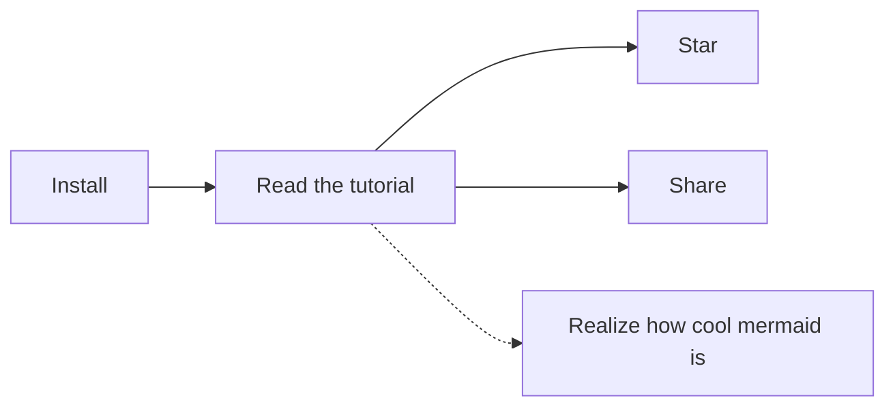

# Markdown 문서 작업 환경
## 초기 문서 작업 환경

* 마크다운 문서를 작성하는 방법에는 여러가지가 있다. 가장 기본적인 것은 수업시간에 사용하였던 가상머신에서 리눅스 환경에서의 vim 을 사용하는 것이다. 이 방법의 장점은 git을 리눅스에서 사용하기 때문에 따로 프로그램을 설치할 필요 없이 터미널 환경에서 사용할 수 있다는 점이었다. 그렇지만 vim만의 명령어를 숙지하는데 불편하고 또한 문서 편집 후 보여지는 모습을 바로 볼 수 없다는 단점이 있었다. 따라서 우리는 새로운 방법을 시도 해 보았다.

## atom편집기 사용
* 문서화 작업 중 가장 큰 문제점은 내가 편집한 문서가 post된 화면을 볼 수 없다는 점이었다. 이에 대한 문제를 가장 크게 느끼고 마크다운 문서의 미리보기를 제공하는 편집기를 찾던 중 atop 편집기가 눈에 들어왔다. atom 편집기는 온라인상에 올라와 있는 플러그인 설치를 통해 사용자의 편의에 맞춘 markdonw 문서 편집 환경을 만들 수 있다는 장점이 있다.

### 사용할 편집기 플러그인

* atom 설치 atom 실행 후 setting 항목 클릭
* "+" install 로가서 markdown-mindmap,markdown-preview-enhanced 설치
* 위 플러그인은 앞서 말했던 문제점을 해결해 주는 markdown 문서를 preview 해주는 플러그인 이다.
* 사용 화면


## 마크다운 문법 간단정리

`제목`
# h1
## h2
### h3
#### h4
##### h5
###### h6


`효과`
*이탤릭체* _이테릭체_
**볼드체** __볼드체__
***이텔릭+볼드체*** ___이테릭+볼드체___
~~취소선~~
superscripts^example^
subscripts~example~
<kbd>Cmd+N</kbd>
\\, \/, \$ 특수문자
[]체크박스
[x]체크박스

`선긋기`
***
---


`문단`
* 빨강
  * 파랑
    * 노랑

- 빨강
  - 파랑
    - 노랑

1. 순서대로
2. 번호 매기기

  블럭을 은 앞자리에 빈칸4칸 또는 탭

`인용`
> 인용문입니다.
>> 중첩 인용문입니다.
>>> 중첩 인용문입니다.

`링크`
링크걸기: [하이퍼 텍스트 링크](http://site)
이미지: 
이미지에 링크걸기: [](http://site)
보조설명 링크: 설명한단어[^1] [^1]:설명을 하는 문장을 추가
문서내부링크: [보여지는 텍스트](#이동할위치의텍스트)
  #이동할위치의텍스트
  이동할 위치는 영어는 반드시 "소문자"만 가능하며 띄어쓰기는 - 로 구분해야한다.

`코드삽입`

`인라인 코드삽입`

```문법이름
코드
```

```python
print("helloworld!")
```
`표`
| 값 | 의미 | 기본값 |
|---|:---:|---:|
| `static` | 유형(기준) 없음 / 배치 불가능 | `static` |
| `relative` | 요소 자신을 기준으로 배치 |  |
| `absolute` | 위치 상 부모(조상)요소를 기준으로 배치 |  |
| `fixed` | 브라우저 창을 기준으로 배치 |  |

`마인드 맵`


`마크업 삽입`
<details>
  <summary>Click to show more...</summary>
  <markdown>
- Embedded
  - _Markdown_
  </markdown>
</details>

---
# 앞으로의 포스팅
* 이번 포스팅은 Markdown 문서를 편집하는 환경에 대해 알아 보았다. 하지만 그 전에 리눅스의 환경에서 진행하였던 편집을 윈도우 환경으로 바꾸는 데에 많은 기여를 한 프로그램이 있다. 다음 포스팅에서는 윈도우 환경에서 git을 사용할 수 있도록 지원해 주는 프로그램 gitkraken, gitbash 에 대한 포스팅을 할 예정이다.
